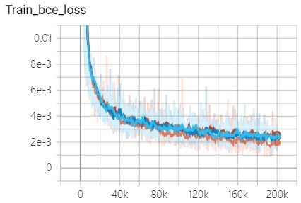
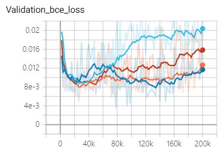
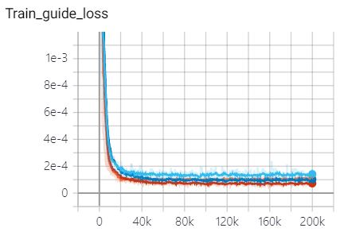
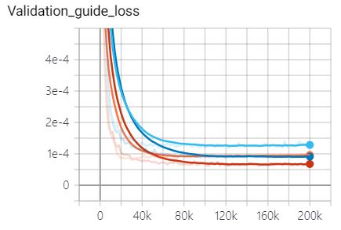
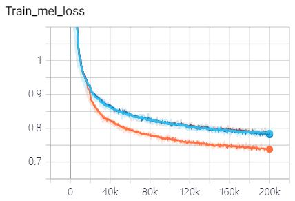
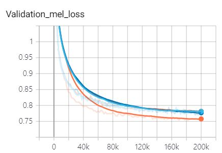
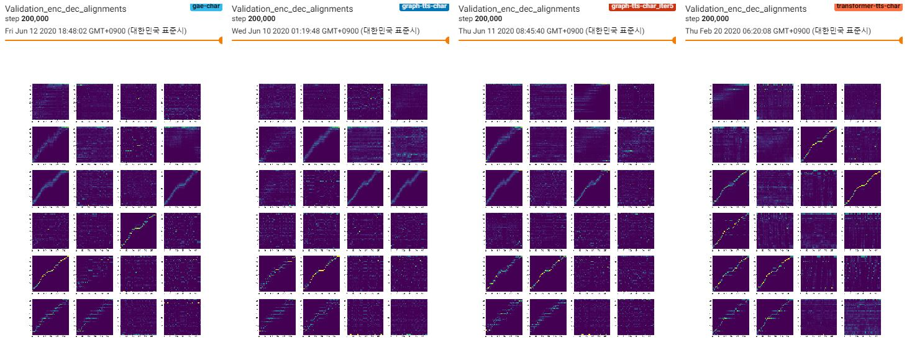
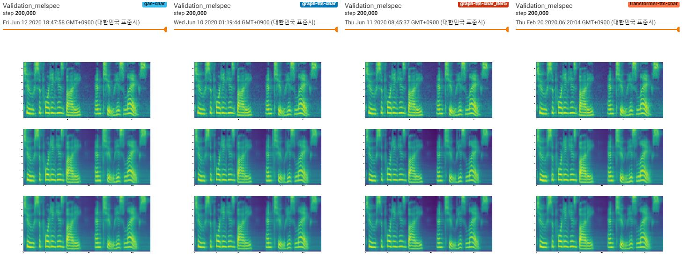
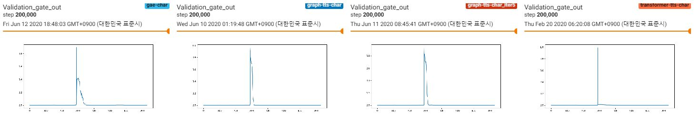

# Graph-TTS
- Implementation of ["GraphTTS: graph-to-sequence modelling in neural text-to-speech"](https://arxiv.org/abs/2003.01924)    

## Training  
1. Download and extract the [LJ Speech dataset](https://keithito.com/LJ-Speech-Dataset/)  
2. Make `preprocessed` folder in LJSpeech directory and make `char_seq` & `phone_seq` & `melspectrogram` folder in it  
3. Set `data_path` in `hparams.py` as the LJSpeech folder  
4. Using `prepare_data.ipynb`, prepare melspectrogram and text (converted into indices) tensors.  
5. `python train.py`  

## Training curve (Orange: transformer-tts / Navy: graph-tts / Red: grap-tts-iter5 / Blue: gae)  
- Stop prediction loss (train / val)  
   
- Guided attention loss (train / val)    
   
- L1 loss (train / val)    
   

## Alignments  
- Encoder-Decoder Alignments  
  
- Melspectrogram  
  
- Stop prediction  
  

## Audio Samples    
You can hear the audio samples [here](https://leeyoonhyung.github.io/GraphTTS/)
You can also hear the audio samples obtained from the Transformer-TTS [here](https://leeyoonhyung.github.io/Transformer-TTS/)

## Notice  
1. Unlike the original paper, I didn't use the encoder-prenet following [espnet](https://github.com/espnet/espnet)  
2. I apply additional ["guided attention loss"](https://arxiv.org/pdf/1710.08969.pdf) to the two heads of the last two layers  
3. Batch size is important, so I use gradient accumulation  
4. You can also use DataParallel. Change the `n_gpus`, `batch_size`, `accumulation` appropriately.  
5. To draw attention plots for every each head, I change return values of the "torch.nn.functional.multi_head_attention_forward()"  
```python
#before
return attn_output, attn_output_weights.sum(dim=1) / num_heads  

#after  
return attn_output, attn_output_weights
```  
3. Among `num_layers*num_heads` attention matrices, the one with the highest focus rate is saved.  

## Reference
1.NVIDIA/tacotron2: https://github.com/NVIDIA/tacotron2  
2.espnet/espnet: https://github.com/espnet/espnet  
